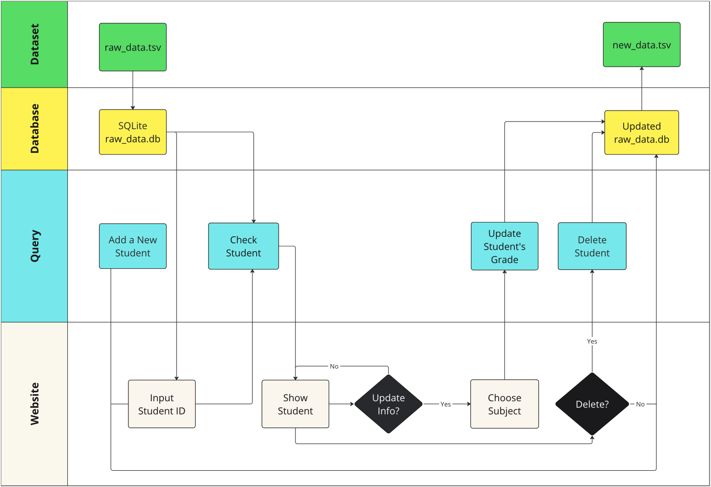
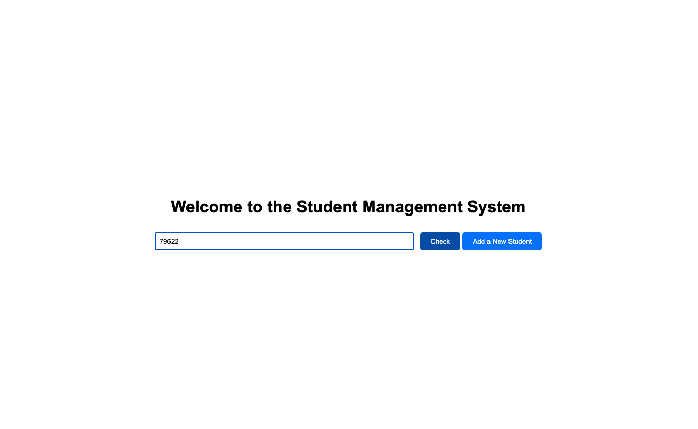
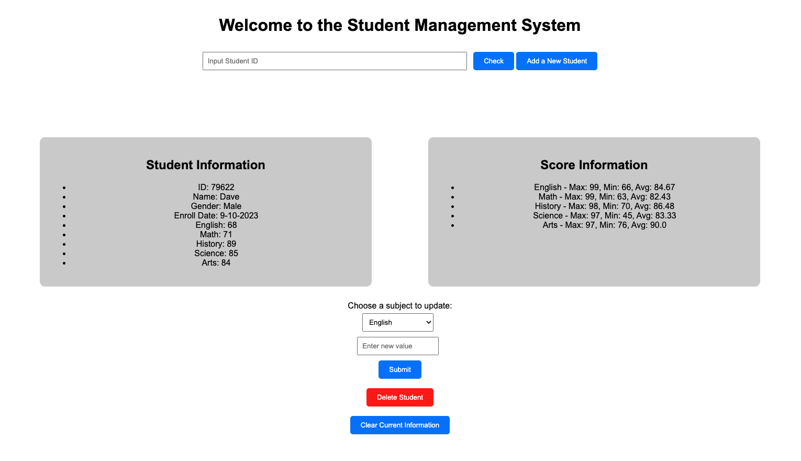
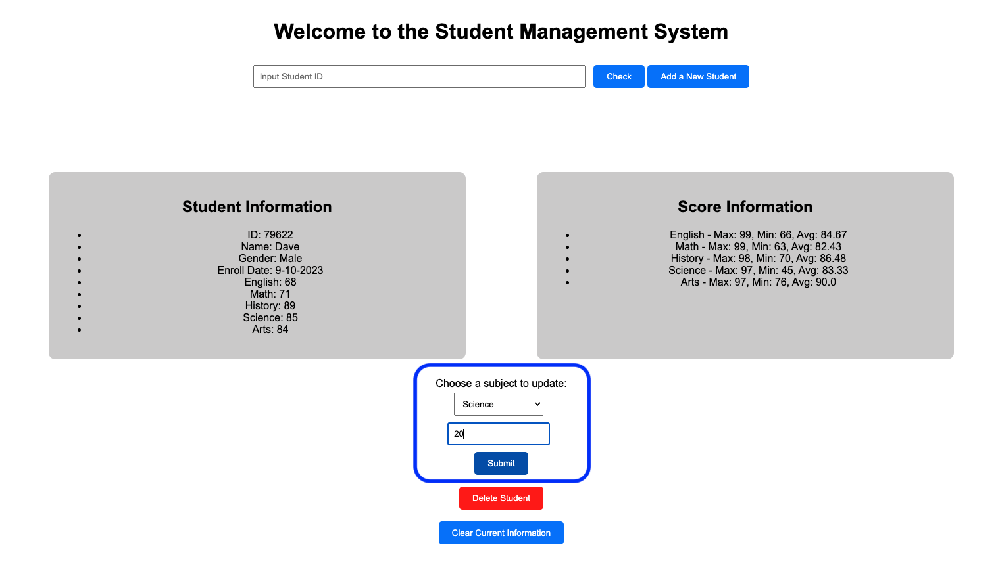
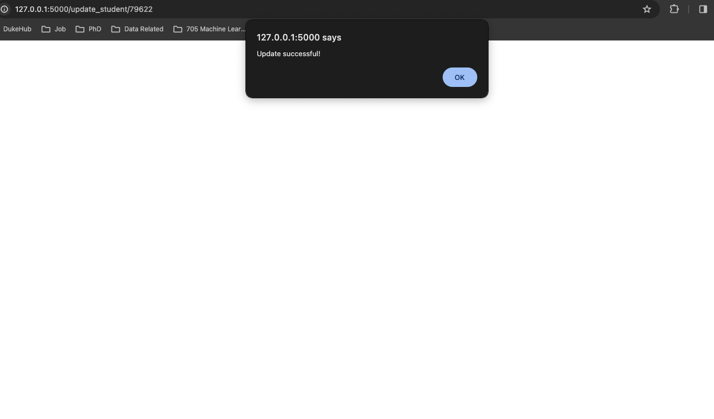
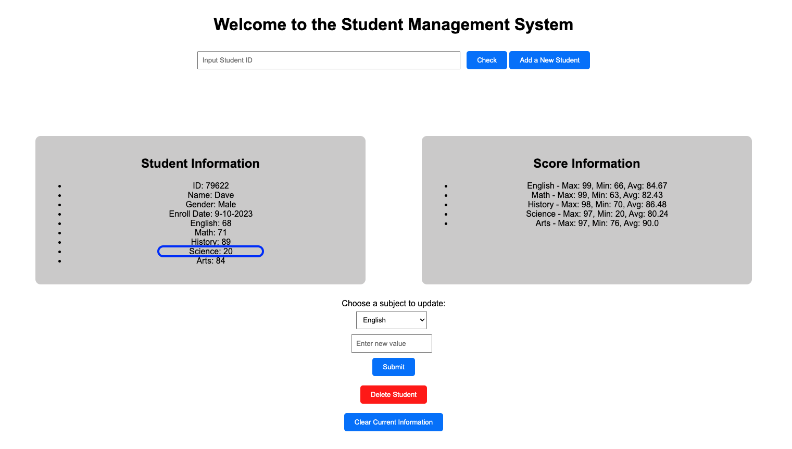
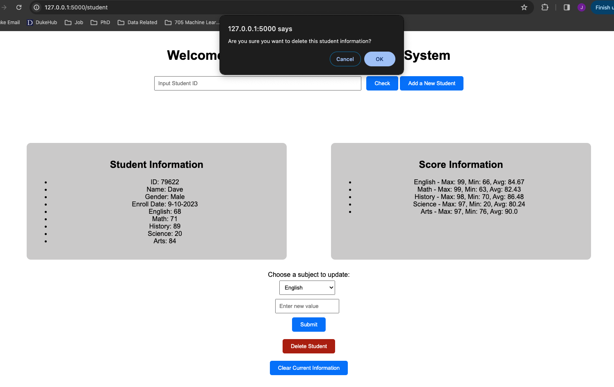
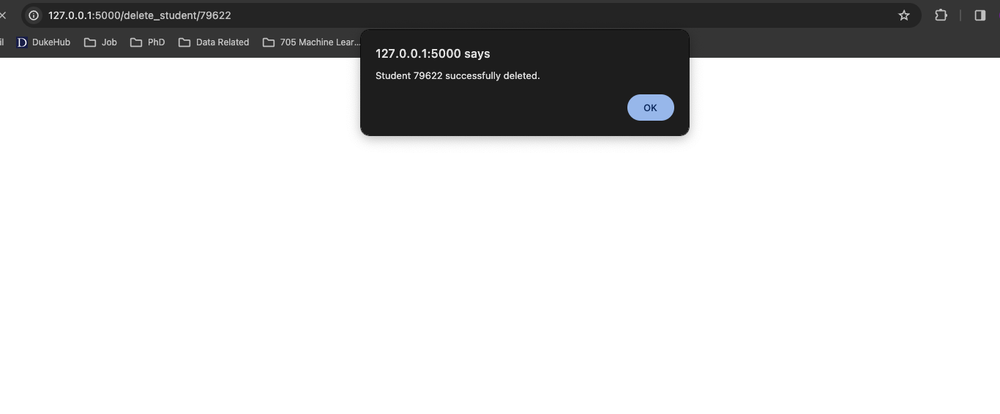
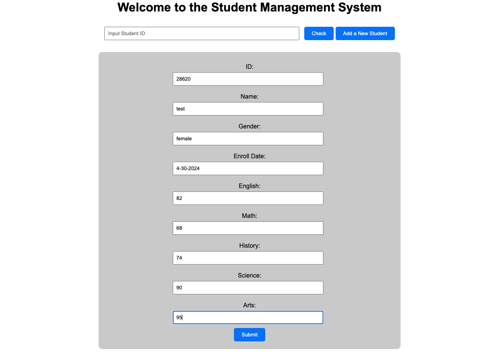
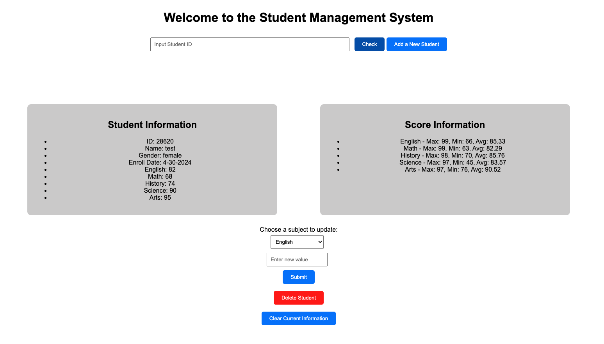

# Student Information Management System

 *Biostats Final Project by Jiechen Li, and Yulei Xia*

This project develops a Python-based application to efficiently manage student information for educational institutions. It supports operations like adding, updating, deleting, and displaying student data, along with calculating grade statistics. The system integrates with a SQLite database and utilizes Flask for web functionality, ensuring a robust backend and user-friendly front end.

## Project Goals

- **Develop robust data management algorithms**: Utilize Python with SQLite to implement efficient data management practices.

- **Enable detailed statistical analysis**: Provide tools for calculating and visualizing grade statistics across various subjects.

- **Enhance user interaction**: Deliver an straightforward web interface for easy interaction with student data.

## System Overview

The system includes several Python classes in ``src/student.py`` designed to handle different aspects of student data management:

- **`StudentManager`**: Manages student information within the database. This class handles tasks such as creating tables, parsing data from TSV files, and performing CRUD operations on student records.

- **`StudentList`**: Represents a comprehensive list of all students in the database. It is utilized to retrieve specific attributes for any student.

- **`Grades`**: Calculates statistical measures such as maximum, minimum, and average scores for various subjects, aiding in the academic assessment of students.

These components ensure that the system not only manages but also thoroughly analyzes student data, providing crucial insights for educational institutions.

## Demo Link

Please watch the project walk-through video [here](https://youtu.be/MWvYG-0WMzs).

## Project Flow Chart

<br>  

## Setup and Installation

Ensure you have Python 3.x installed along with pip. This project also requires Flask and SQLite.

1. **Clone the repository:**

   ```bash
   git clone https://github.com/carrieli15/821Biostats_Final.git
   ```

2. **Navigate to the project directory:**

   ```bash
    cd Student-Information-Management-System
   ```

3. **Install dependencies:**

   ```bash
    pip install -r requirements.txt
   ```

## Running Tests

1. **To run tests and verify system integrity:**

   ```bash
    pytest
   ```

2. **To check code quality using Ruff:**

   ```bash
     ruff check $(git ls-files '*.py')
     ruff format --check $(git ls-files '*.py')
     mypy $(git ls-files '*.py')
   ```

## Using the System

1. **Start the Flask application:**

   ```bash
    flask run
   ```

2. **Access the web interface at <http://127.0.0.1:5000/> to interact with the student data.**

## Building the Database

**Step 1**: Import the raw dataset ``student.tsv``to the SQLite database, and generate ``check_student.db`` for query.

**Step 2**: Perform students' data insertion, add new student records.

**Step 3**: Perform students' data deletion, remove existing student records.

**Step 4**: Perform students' data updating, modify details of existing records.

**Step 5**: Perform students' data display, show all current student records.

**Step 6**: Perform students' data calculation with average, maximum, and minimum scores.

**Step 7**: Export modified students' data into ``new_student.tsv`` as a new dataset.

**Step 8**: Develop Flask code with existing database logic for our client.

**Step 9**: Develop HTML and JavaScript files for website rendering.

## Example Screenshots

Detailed steps on how to ``add``, ``update``, ``delete``, and ``view`` student information are provided through our web interface.

**Select the student's ID you are interested in.**

**Check a student by ID**:
<br>  

<br>

**Update the student's grade of any subject**:
<br>

<br>

<br>

**Delete a student's information**:
<br>  

<br>  

**Add a new student's information**:
<br>  

<br>  

<br>  

## Contributions

Contributions are welcome! Please fork the repository and submit pull requests to the `develop` branch.

## License

This project is licensed under the MIT License - see the [LICENSE](LICENSE) file for details.
