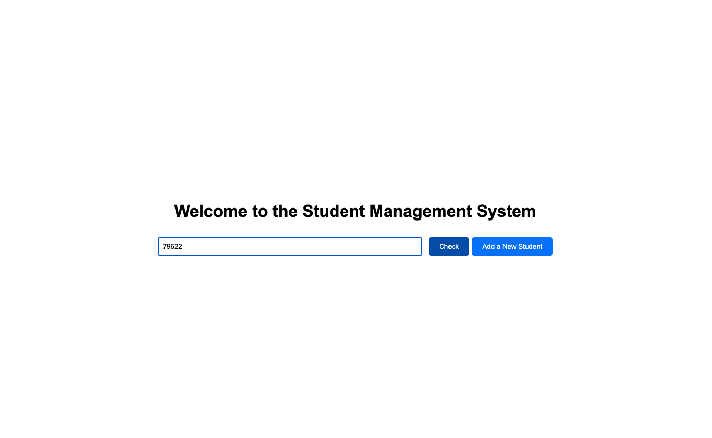
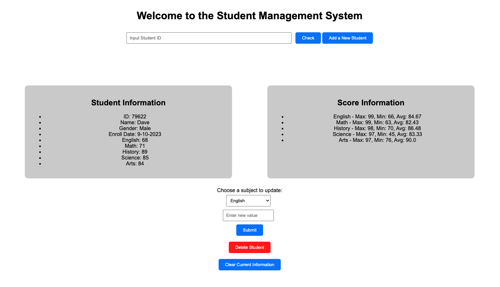
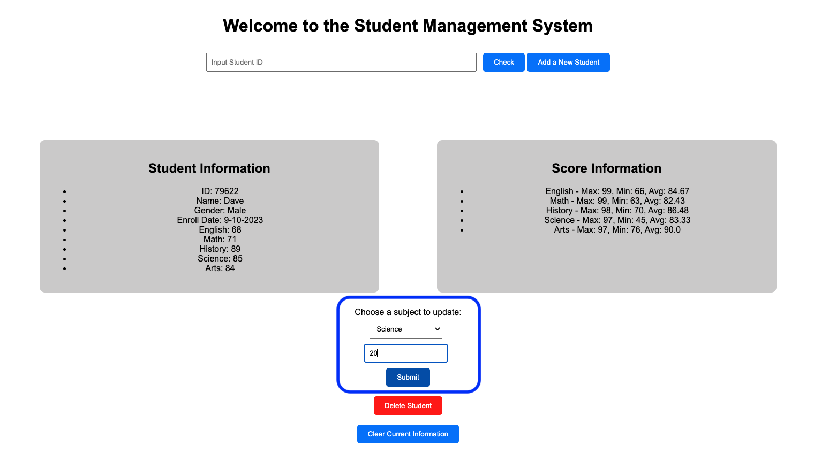
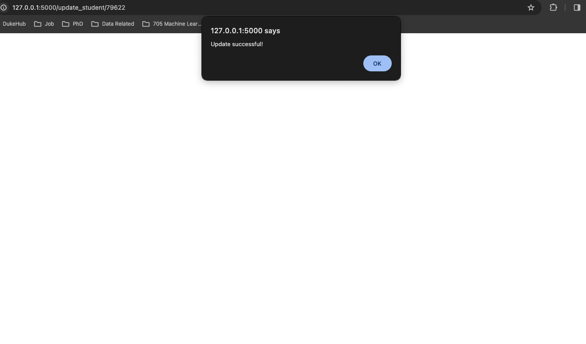
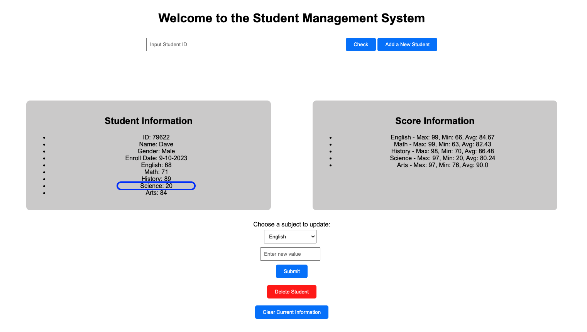
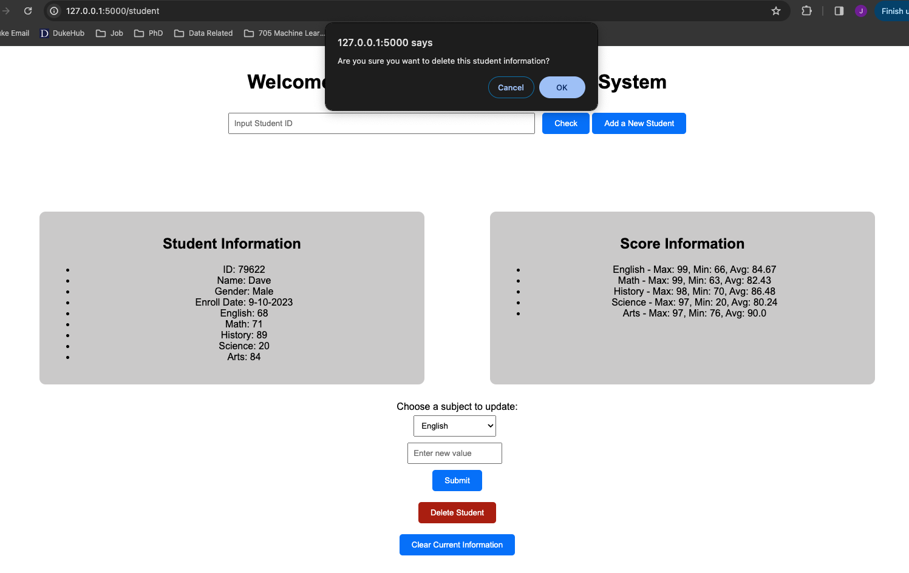
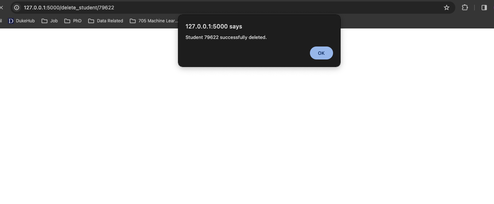
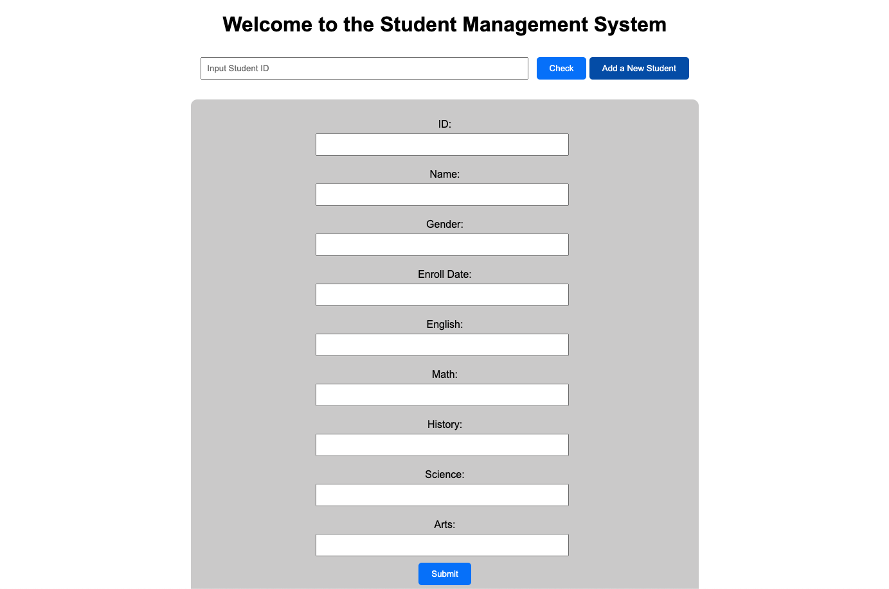
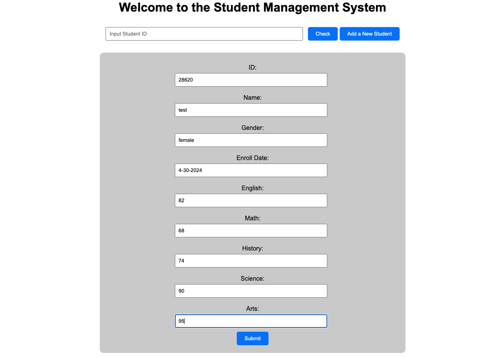
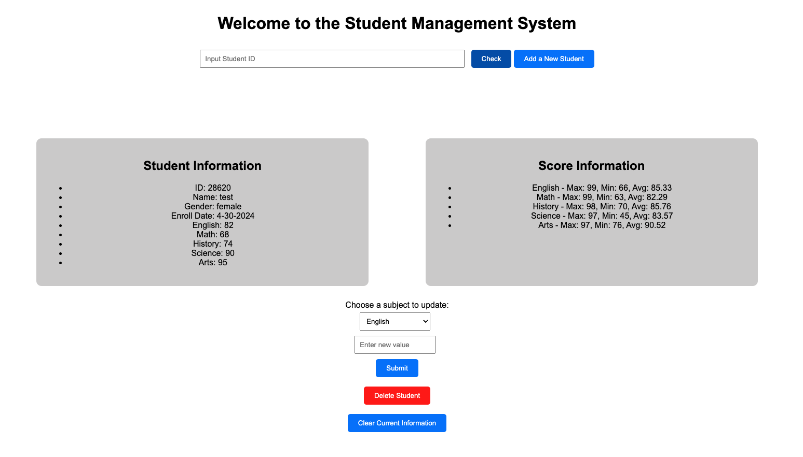

# Student Information Management System

 *Biostats Final Project by Jiechen Li, and Yulei Xia*

## Project Goals

The student information management system is a Python-based application designed to help educational institutions manage student data efficiently. This system allows users to perform various operations such as adding, updating, deleting, and displaying student information, as well as computing and displaying statistics on students' grades.

## Demo Link

Please click this [link](https://youtu.be/MWvYG-0WMzs) to watch our project walk-through video.

## Building the Database

**Step 1**: Import the raw dataset ``student.tsv``to the SQLite database, and generate ``check_student.db`` for query.
**Step 2**: Perform students' data insertion, add new student records.
**Step 3**: Perform students' data deletion, remove existing student records.
**Step 4**: Perform students' data updating, modify details of existing records.
**Step 5**: Perform students' data display, show all current student records.
**Step 6**: Perform students' data calculation with average, maximum, and minimum scores.
**Step 7**: Export modified students' data into ``new_student.tsv`` as a new dataset.
**Step 8**: Develop Flask code with existing database logic for our client.
**Step 9**: Develop HTML and JavaScript files for website rendering.

## Using Student Information Management System

* Select the student's ID you are interested in.

* **Check a student by ID**:
   

 

* **Update the student's grade of any subject**:
 

 

 

* **Delete a student's information**:
   

   

* **Add a new student's information**:
   

   

   
